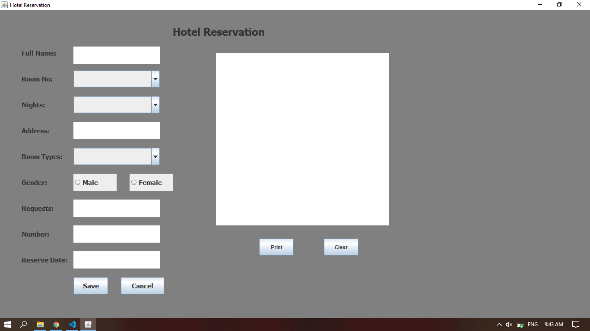
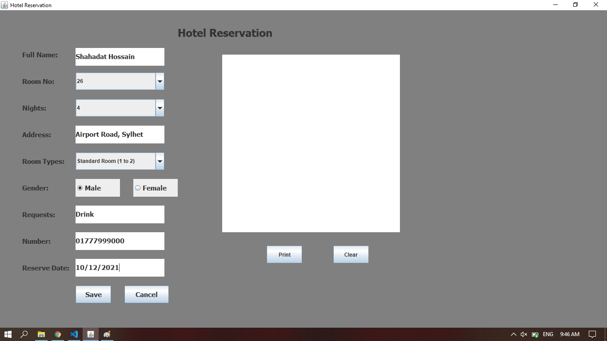
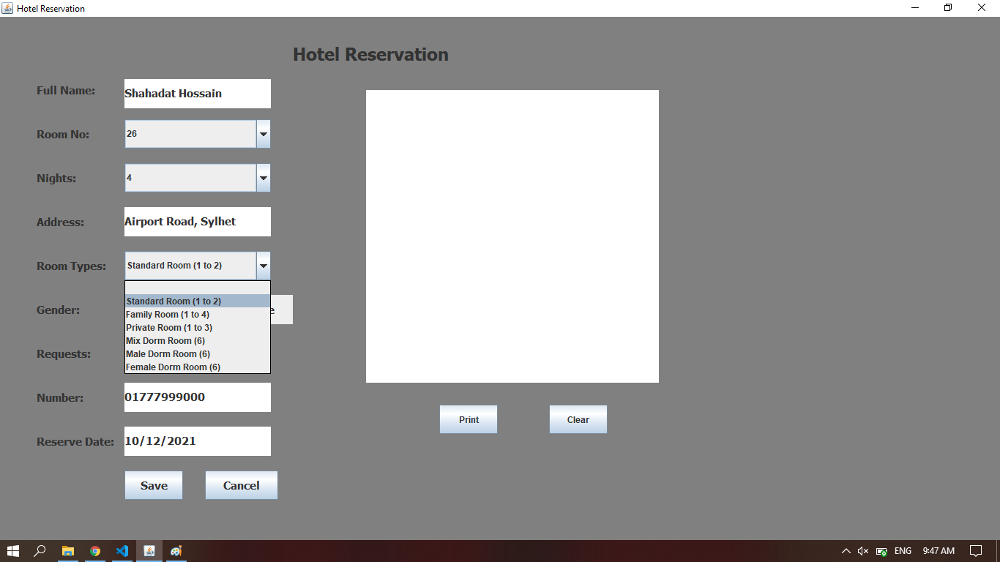
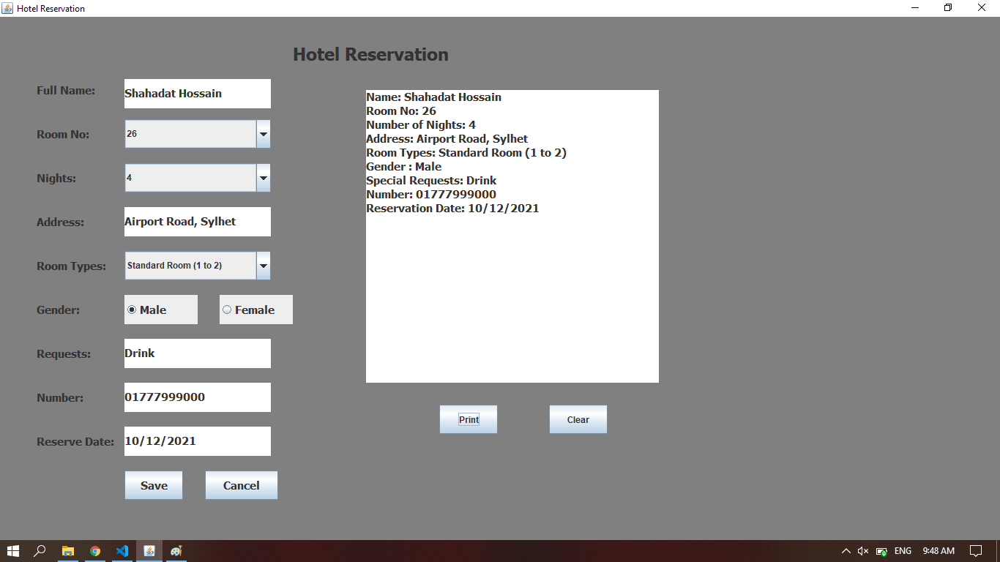
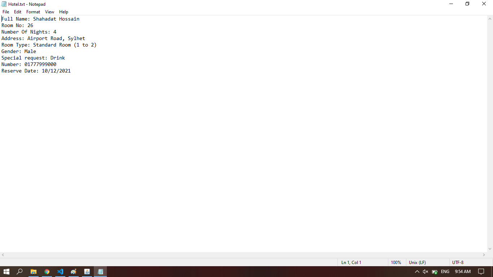

                                                        
## **Project Summary**:

A Simple Hotel Reservation System Using OOP.

## **Goals**:

Everybody want's to enjoy their vacation after a busy timeline.but it's tough to manage a hotel.using this project anyone can easily choice and reserve their hotel package from home.user can choice all the facilities according to their needs.

## **Tools**:

* JAVA

## **Project Features**:

* Simple Reservation Form
* Necessary Information 
* Feature of Choicing Room Numbers
* Feature of Choicing Room Type
* Special Request
* Saving Information in Temp Memory
* Cleaning Information from Temp Memory
* Print the information in Text File 

## **User Interface**:

 
    
 
    
 
    
 
    
 
    

